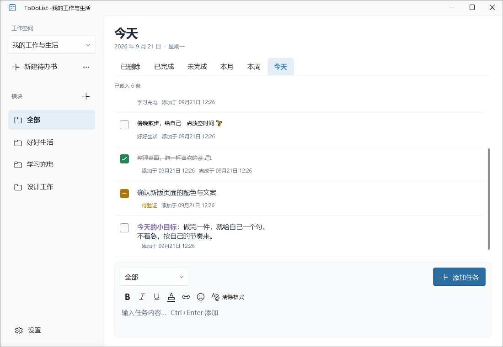

# ToDoList

本地优先的 Windows 待办应用，使用 .NET 10、WPF UI 4.3.0 与 SQLite。维护者：**H-J-F**；本项目代码采用 [MIT](LICENSE) 许可。

**本项目由 H-J-F 维护，开发过程中使用 AI 辅助进行代码编写、重构、测试及文档整理。已验证功能与环境范围见验证报告。**



## 获取与运行

仓库：[H-J-F/ToDoList](https://github.com/H-J-F/ToDoList)。[正式版本下载入口](https://github.com/H-J-F/ToDoList/releases)。**2.1.0 目前仍在本地验证阶段，本轮未创建标签或 GitHub Release。**

本地构建提供两版，均为 Windows x64：

| 包名 | 适用情况 |
| --- | --- |
| `Build/ToDoList-2.1.0-win-x64-lite/` | 精简版，需要安装 [.NET 10 Desktop Runtime x64](https://dotnet.microsoft.com/zh-cn/download/dotnet/10.0)，交付文件总量小于 50,000,000 字节 |
| `Build/ToDoList-2.1.0-win-x64-portable/` | 自带运行时，程序压缩为单个 EXE；无需预装 .NET，首次运行会解压必要原生组件 |

在可写目录中双击 `ToDoList.exe`。本地构建只生成程序目录，不自动创建压缩包。两版均在程序同级 `Data` 保存任务和设置，数据互通；体积统计不包含用户数据及单独安装的共享运行时。请保留随程序提供的使用说明和许可证材料。当前构建**尚未进行代码签名**；可信签名及 Microsoft Store 为后续事项。

升级前关闭应用并备份整个 `Data`，解压新程序后保留原 `Data`。不要运行时手动替换数据库。应用不会上传任务；关于卡片只通过默认浏览器打开公开仓库。

## 使用方法

首次启动点击“创建待办书”，标识名只能为 1–64 个 ASCII 英文字母或数字（可纯数字），大小写不敏感，不允许 Windows 保留名称；展示标题允许中文。每本书对应 `Data/<标识名>.db`，备份位于 `Data/Backup`。

| 操作 | 方法 |
| --- | --- |
| 新建、切换待办书 | 左上选择器及“新建待办书” |
| 导入、导出 | 待办书操作菜单 |
| 新建模块 | 左侧模块目录的加号、右键菜单，或底部“新增模块” |
| 新增任务 | 选择模块，填写内容，Enter 或“添加任务”（兼容 Ctrl+Enter） |
| 换行及格式 | Shift+Enter 换行；工具栏或 Ctrl+B/I/U；支持颜色、链接与彩色表情 |
| 文字颜色 | 24 个预设色、自动跟随主题、最近 8 色、自定义 `#RRGGBB` |
| 表情 | 中文分类、每行 8 项、最近使用；也可用 Win+.；Esc 关闭面板 |
| 修改内容 | 双击正文，Enter 保存（兼容 Ctrl+Enter），Esc 取消 |
| 完成／恢复未完成 | 单击勾选框，或焦点在勾选框时按空格 |
| 待验证／取消待验证 | 长按勾选框 600ms，或 Shift+空格 |
| 删除／恢复 | 任务右键菜单或 Shift+F10，恢复至删除前状态 |
| 打开链接 | Ctrl+单击 |
| 已完成排序 | 右上排序入口悬停或键盘聚焦，选择添加／完成日期 |
| 外观及关于 | 左下设置；再次点击设置或点击面板外关闭；关于卡片可打开本仓库 |
| 查看所有任务 | 顶部最左“所有”，包含当前模块的全部状态任务 |
| 日历筛选 | “今天”右侧日历，选择整年／整月／整日后应用；再次点击、外部点击或 Esc 关闭 |
| 导出报告 | 页面右上“导出报告”，选择模块、状态、添加时间范围和 MD／DOCX／PDF，默认 MD |

“全部”汇总本书任务；新增时选“全部”表示不归属具体模块。任务创建后只能修改内容，不能改变模块。既有模块名称保持原样。

未完成包括黄色待验证，已完成只包括当前完成任务。已删除为可恢复的逻辑删除，使用红色图标及红色删除线，不能编辑或勾选；恢复后撤销状态装饰，保留原富文本格式及原完成时间。第一版不提供永久删除、模块删除、书删除或重命名。

“所有”不限制日期；今天、本周、本月及日历按**添加时间**筛选，包含所有状态；一周从周一开始。全部页签均为**上旧下新**，同时间按任务 ID 稳定排序。已删除按删除时间；已完成可按添加或完成时间；日期标题与排序依据一致。每条任务显示添加时间及适用的完成／删除时间。

进入待办书、模块或页签时加载最新 200 条并定位底部；向上翻阅历史，向下返回较新任务。新增任务符合当前筛选时定位最新任务，不符合时提示其所在模块并保留当前视图。

富文本以结构化 JSON 和纯文本保存；表情仍存 Unicode，使用 Emoji.Wpf 绘制系统字体提供的彩色字形，无法绘制时保留原文。支持组合表情、肤色、复制剪切与撤销重做；字体所支持的字形随 Windows 版本而异。图片、附件及复杂文档布局不属于本版格式。

## 任务报告

“导出报告”分别选择全部／单个模块、所有／已删除／已完成／未完成（含待验证）、不限时间／整年／整月／整日／自定义起止日期。结束日包含全天，日期按本机时区和任务添加时间计算；默认沿用当前模块、状态和日期条件，格式每次默认 Markdown。

报告包含书名、筛选条件、导出时间、各状态数量，以及每条任务的模块、状态、纯文本正文和添加／完成／删除时间，按添加时间从旧到新排序。不受列表已加载数量限制；零结果也可导出概要。报告从同一数据库快照生成，不包含尚未保存的草稿。

MD 为 UTF-8；DOCX 可用 Word 打开；PDF 自动换行分页，使用本机字体生成中文和彩色表情。DOCX 的表情外观随阅读软件而异。导出过程无需安装 Office、连接网络或使用 PDF 打印机，原有整书 `.db` 导出继续用于备份。报告须保存在 Data 目录之外。

## 导入与备份

- 导出使用 SQLite 备份 API，包含已提交的 WAL 内容。
- 导入以数据库内部标识判断身份，修改文件名不会改变身份。
- 同名书可合并、覆盖或取消；合并、覆盖前自动备份原书。
- 合并按任务 UUID 和修改时间保留较新的完整版本，相同时保留本地；删除和恢复记录参与比较。历史事件按 UUID 去重。
- 独立新增的同名模块映射合并；本地书标题、书内排序偏好及全局外观设置保持不变。
- v1 数据库升级为 v2 前先备份；导入旧库只升级暂存副本，不改源文件。拒绝损坏、未知新版及内容不一致的数据库。
- 迁移或替换失败时保留原库。Data 不可写会提示，不会擅自换目录。

## 界面与性能

WPF UI 的 FluentWindow、TitleBar、CardAction、按钮、文本框、ContentDialog、Snackbar；ComboBox、CheckBox、菜单、滚动条采用该库为 WPF 原生控件提供的样式。功能图标使用 SymbolIcon，不使用字符拼凑箭头。

浅色／深色／跟随系统，蓝、青绿、浅橙、紫四种强调色，12／14／16／18 DIP，紧凑／舒适及减少动态效果。正文使用系统 Microsoft YaHei UI，Normal 字重，Display + ClearType；图标使用库字体、Ideal + Grayscale。实际清晰度也受屏幕 DPI、ClearType 校准及系统字体影响，不分发 Windows 字体文件。

SQLite 索引与双向游标分页，每批 200 条，最多 2,000 条／32MiB 内容缓存，Recycling 虚拟化；任务编辑共用一个空闲时预热的 RichTextBox，不为每行创建编辑器。状态持久化与历史写入同事务；每行独立退出动画，容器复用清理动画。数据查询在后台执行，旧请求取消且按查询代号隔离。

## Rider 开发与本地打包

安装 Windows .NET 10 SDK，用 Rider 打开 `ToDoList.sln`，启动 `ToDoList.App`。

```powershell
dotnet build ToDoList.sln -c Release
dotnet test tests/ToDoList.Tests -c Release
./tools/Publish.ps1 -Variant Both
python tools/Verify-Build.py Build
```

构建脚本可选 `Lite`、`Portable` 或 `Both`，统一输出到项目一级目录 `Build`（与 `artifacts` 同级），不存在时自动创建，并记录程序体积。需要保留多个构建时可指定 `-OutputRoot ./Build/自定义目录`；禁止输出到 Build 之外。已有程序目录会拒绝覆盖，避免破坏 Data。更新前关闭应用并备份整个 Data，移除旧程序目录后重新构建，再复制 Data 到新程序同级目录；不要合并不同待办书数据库文件。脚本不生成 ZIP、上传、创建标签或发布 Release。使用 Release、关闭调试符号、保留中文及中性资源，不采用不受支持的 WPF 裁剪。

测试工具与实际覆盖范围见 [筛选与报告回归](docs/VALIDATION-REPORTS.md)、[字体与构建回归报告](docs/VALIDATION-TYPOGRAPHY.md)、[2.1 验证报告](docs/VALIDATION-2.1.md)，历史报告见 [VALIDATION](docs/VALIDATION.md)。应用支持 `--data-dir <独立测试目录> --ui-smoke`、`--ui-typography`、`--ui-perf`、`--ui-features` 和 `--ui-demo`；测试必须使用隔离目录，不能指向真实数据。

## 版权与第三方

Copyright (c) 2026 H-J-F。本项目的 MIT 不替代第三方许可。完整清单见 [THIRD-PARTY](docs/THIRD-PARTY.md)，实际解析版本及包哈希见 [DEPENDENCIES.json](docs/DEPENDENCIES.json)，许可原文位于 [docs/licenses](docs/licenses)。

尤其注意：**Emoji.Wpf 0.3.4 与 Stfu 为 WTFPL，并非 MIT**。WPF UI 及 Fluent System Icons 为 MIT。内置 Typography、Unicode 数据、SQLite 和便携版 .NET 运行时的各自声明随两版程序附带。
